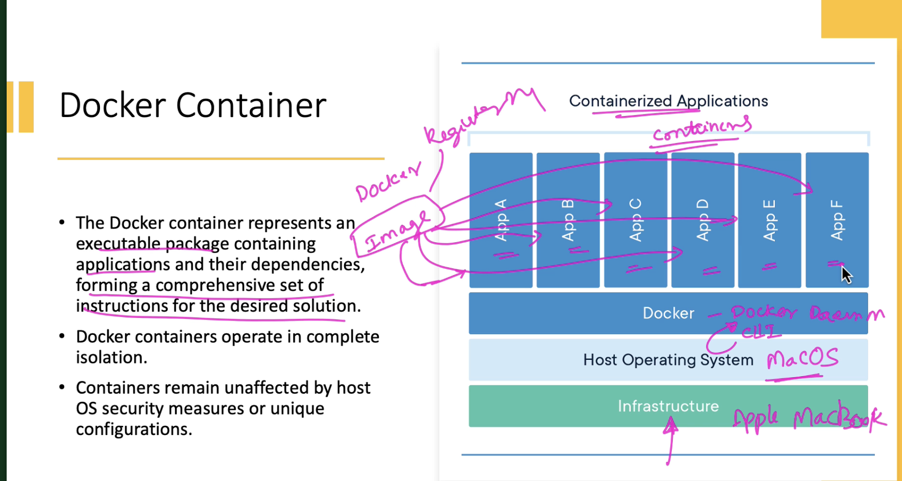
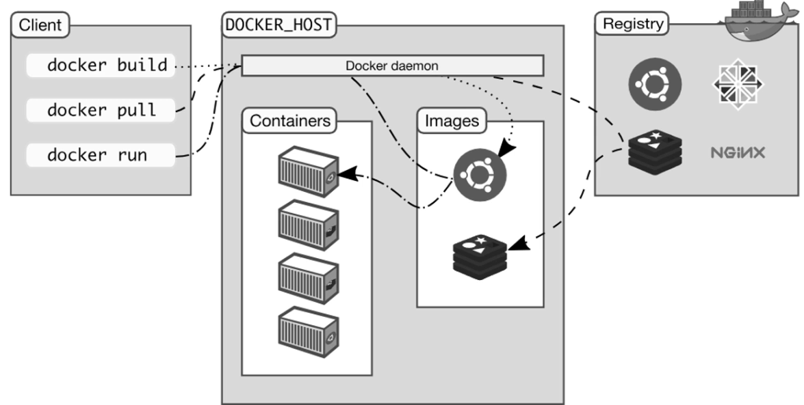

# Docker
It is a software platform that employs OS virtualization, enabling IT organisations to swiftly generate, deploy and execute applications within Docker containers.
These containers encapsulate all the necessary dependencies, including framework, libraries and binaries, making them lightweight and self-sufficient.

## Benefits
- Facilitates migration across various environments
- During DevOps lifecycle, Docker excels primarily in deployment. During deployment the priority is to ensure that thouroughly tested code functions seamlessly in production environment
- Having a container running the solution is advantageous as it allows us validate the work in an environment which is identical to production
- The configuration process is facilitated through YAML, a language that describes the desired Docker environment, enabling seamless scalibility

## Container vs Virtual Machine (VM)

**Docker**: 
- Works on Docker engine layer. 
- Docker environments maintain low memory usage. 
- Due to single Docker engine, Docker delivers high performance
- Docker containers not dependent on host environment (where Docker is installed)
- Instant start-up provides significant boost in the start-up time
- Allows reallocation of unused memory to be used across other containers within the enviornment
- It is designed to run multiple containers withing the same environment

**Virtual Machines (VM)**:
- Functions on Hypervisor layer
- VMs consume high amount of memory
- Tend to give poor performance when multiple instances are running
- Rely on host OS, causing portability issues
- VMs boot-up slowly
- Does not allow memory reallocation
- Running multiple VMs on same environment can lead to performance and stability issues

## How does it work?
It operates via Docker engine which consists of 2 components - a server and a client. These 2 components communicate though a RestAPI

## Components of Docker

### Docker client and server
- The CLI is the client (like Terminal in Mac).
- The Docker daemon serves as a server. It facilitates interactions with the operating system and executing services. - It continuously monitors the REST API for specific requests.
- There is also a Docker host which enables running the docker daemon and the registry

### Docker image
- It is a template which contains instructions for the Docker container, written in YAML file.
- An image consists of multiple crucial layers, with each layer building upon the one beneath it
- These layers are formed as each command in Docker file is executed and are maintained in a read-only format
- The intial is the base layer, containing the base image and operating system, followed by additional layers of dependencies
- together, these layers form the instructions stored in a Read-Only file, which becomes the Docker file

### Docker registry (Dockerhub)
- it serves as a platform to host and distribute various types of images
- images are built based on instructions written in YAML and can be easliy stored and shared
- each image within the registry is given a name tag, making it convenient of users to find and share them
- managing a registry can begin with the widely accessible Docker hub registry, open to the public, or we can setup our own internal registry for our private use

### Docker container



- represents an executable package containing applications and their dependencies, forming a comprehensive set of instructions for the desired solution.
- it operates in complete isolation
- containers remain unaffected by Host OS security measures or unique configuration

### How they all work together



If I have created a Docker image created from docker files and the image is saved on DockerHub. I can pull the image from DockerHub and run it (by creating the instances of the Docker image).

## Test Run

- `docker run hello-world`
- `docker run busybox echo "hello from container"`
- `docker ps`: list of currently running containers. Using `--all` or `-a` attribute will list all the container (running or stopped)
- `docker run -it busybox sh`: to run a container as shell script. In `-it`, 'i' means interactive and 't' means 'TTY'.
- `docker run -d <image name>`: run a container in the background
- `docker start|stop <container name> (or <container id>)`: start or stop a container
- `docker rm <container name>`: remove a container
- `docker run --name <container name (custom name)> <image name>`: create a container with a custom name
- `docker run -d -P <container name>`: '-P' is going to expose a random port in the local system to a docker port. to extract the port number `docker port <container name>`
- `docker run -p 8888:5000 <container name>`: will expose the port of 8888 in the local system to the port of 5000

## How to build a container?
Taking an example of a flask application:
- keep app.py, templates, data, requirements file, Dockerfile and all the other files relevant to run the application, in a folder
- Dockerfile follow a yaml like formal. We need to specifiy:
    1. base image on which the application will be built (for Flask app it should be a python image)
    2. location of the working directory
    3. list of files to copy
    4. install dependencies using the requirements file
    5. the port number
    6. the command to execute when the container is run

- Sample code for dockerfile
```
FROM python:3.8

# set a directory for the app
WORKDIR /usr/src/app

# copy all the files to the container
COPY . .

# install dependencies
RUN pip install --no-cache-dir -r requirements.txt

# tell the port number the container should expose
EXPOSE 5000

# run the command
CMD ["python", "./app.py"]
```

- to build the image go the folder location via terminal and run `docker build -t <image_name>`

## Pushing to DockerHub (registry)

- login to dockerhub via terminal `docker login`
- build the image `docker build -t <image_name>`
- `docker push <image_name>`


