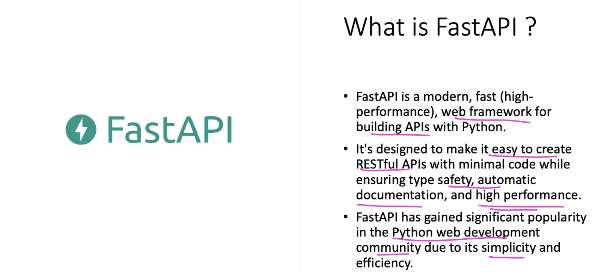

## Application Programming Interface (API)
An API is a software gateway that allows different software components to communicate with each other. It help expose the capabilities of an application to the outer world, allowing for the programmatic access to their data.


## What is REST (Representational State Transfer)?
- REST is an architectural style for designing networked applications
- It is not a technology or a protocol but rather a set of constraints and principles that define how web services should be structured and how they should behave
- REST is commonly used in the context of building web services and APIs
- It leverages the HTTP protocol making it simple and widely adopted approach for creation of distributed and scalable system on web

When we build an API with REST context, it is called REST API.

### REST API
- REST is an architectural style which defines a set of constraints to be used for creating web services
- REST API is a way of accessing the web services in a simple and flexible way without having any processing

### Why Rest technology is preferred?
REST is generally preferred over more robust Simple Object Access Protocol (SOAP) technology because:
 - REST used less bandwidth 
 - simple to use
 - Flexible and suitable for internet usage

All communication done via REST API uses HTTP request only.


## How REST API works?
Everything is considered as a resource. Resource can be data object, services or even abstract concept. Each resource is identified by a unique URI (Unique Resource Identifier), similar to a web URL. REST APIs use standard HTTP methods to perform actions on resource.

### Common HTTP method
- **GET** - Retrieve data from a resource. When a client sends a GET request to a resource's URI, the server responds with the resource's representation (usually in JSON or XML).

- **POST** - Create a new resource. Client use POST to send data to the server, typically to add new entries or perform actions that create new resources. The server responds with information about the created resources

- **PUT** - Update an existing resource. Client use PUT to send updated data to the server to modify an existing resource identified by its URI

- **DELETE** - Remove a resource. A DELETE request instructs the server to deleted the resource specified in the URI


## Stateless communication
The RESTful communication is stateless, meaning each request from a client to the server should contain all the information necessary to understand and process the request.

The server should not rely on any previous request or store client-specific information between requests.
This statelessness makes RESTful systems scalable and easy to maintain.

### Responses
When the server receives a request, it processes the request based on the HTTP method and the resource's URI. It then sends back a HTTP response to the client. The response typically includes:
- Status code (eg: 200 - OK, 201 - Created, 404 - Not found) indicating the result of the request
- Headers with metadata about the response
- The resource's representation is in a format like JSON or XML


## Summary
Client interact with the resources using REST API by sending HTTP requests. The HTTP request includes HTTP methods and include any required data or parameter.
The server processes these requests and sends back HTTP responses, which can contain data, error message, or status information.
This exchange of requests and responses enables clients to interact with the server and access or manipulate resource in the system

## FastAPI




Install FastAPI - pip install "fastapi[all]"

### Crash course:
- create a python file named main.py and write the following code in the file

```python
from fastapi import FastAPI

app = FastAPI()
@app.get('/')
async def root():
    return {"message": "Hello World from FastAPI!"}
```

- run the script using `uvicorn main:app --reload` in the terminal. Here, 'main' is the name of the file & 'app' is the name of the application in the script
- FastAPI generate automatic documentation. Suppose running the above command gave this link - http://127.0.0.1:8000. Add '/docs' to see the documentation page. So, the doumentation link will be `http://127.0.0.1:8000/docs`
    - alternate documentation link - `http://127.0.0.1:8000/redoc`
    - Documentation page has `try out` option which can be used to test the API in the UI itself