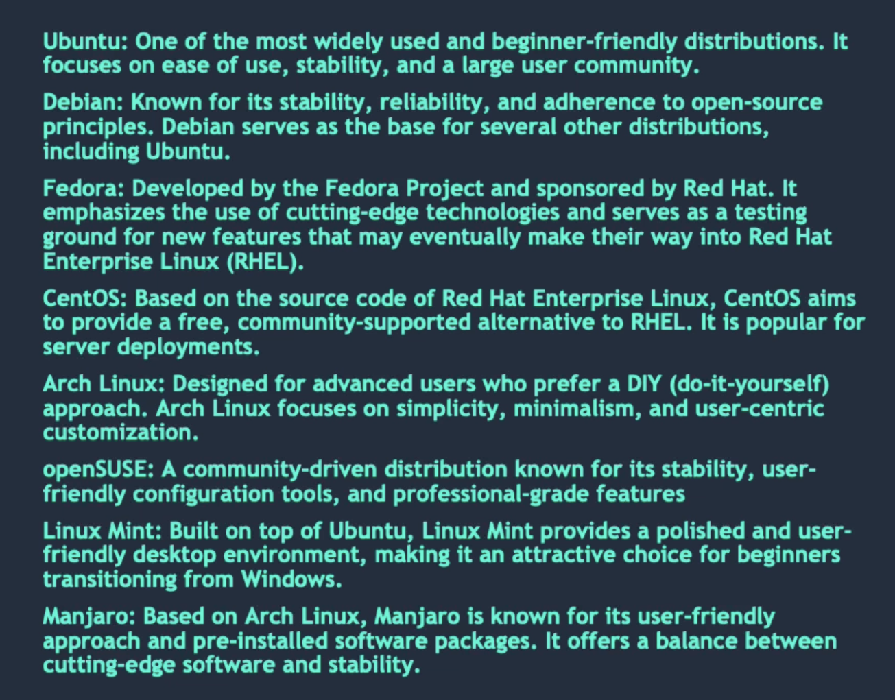

## Components of linux OS
1. Bootloader: software which manages the computer's boot process
2. Kernel: The kernel, known as "Linux" is the core component of the system
3. Init system: This sub-system initiates the user space and controls daemons
4. Daemons: These are the background services like printing, sound and scheduling that either start during boot or after logging into the desktop
5. Graphical server: Also, referred to as X server or X , this subsystem handles graphics display on the monitor
6. Desktop: this is the part of operating system that users directly interact with
7. Applications: While desktop environments have limited applications, Linux, like Windows and MacOS, provides a vaast selection of high quality software title.

## Why use Linux?
- Open source: source code is freely available
- Stability and reliability
- Security: due to open source nature, security vulnerabilities can be identified and fixed by the community
- Flexibility and customizations
- Linux distributions provide centralized software repositories and package management systems
- large community support
- cost effective

## What is a "distribution"?
A linux distribution, also known as distro, is a complete operating system package that consists of the Linux kernel, various software applications, libraries and configuration files. Different distributions may have different default software, desktop env, package management systems and overall philosophies.
They are created and maintained by different orgs and communities, each with its own goals and target audience

### Popular distribution

## Bash in Linux
It stands for "Bourne again Shell". It is a command-line interpreter and scripting language that is widely used in Linux and Unix-based operating systems.
Bash provides a textual interface for the users to interact with the operating system by executing commands.
Bash offers powerful features and capabilities, including command-line completion, command history, variables, conditions, loops, functions and input/output redirection.

## Package managers:
1. APT - Debian
2. YUM - Fedora, centOS, RHEL
3. DNF - used in RPM based distribution. successor of YUM
4. Pacman - ArchLinux
5. Zypper - OpenSuse

